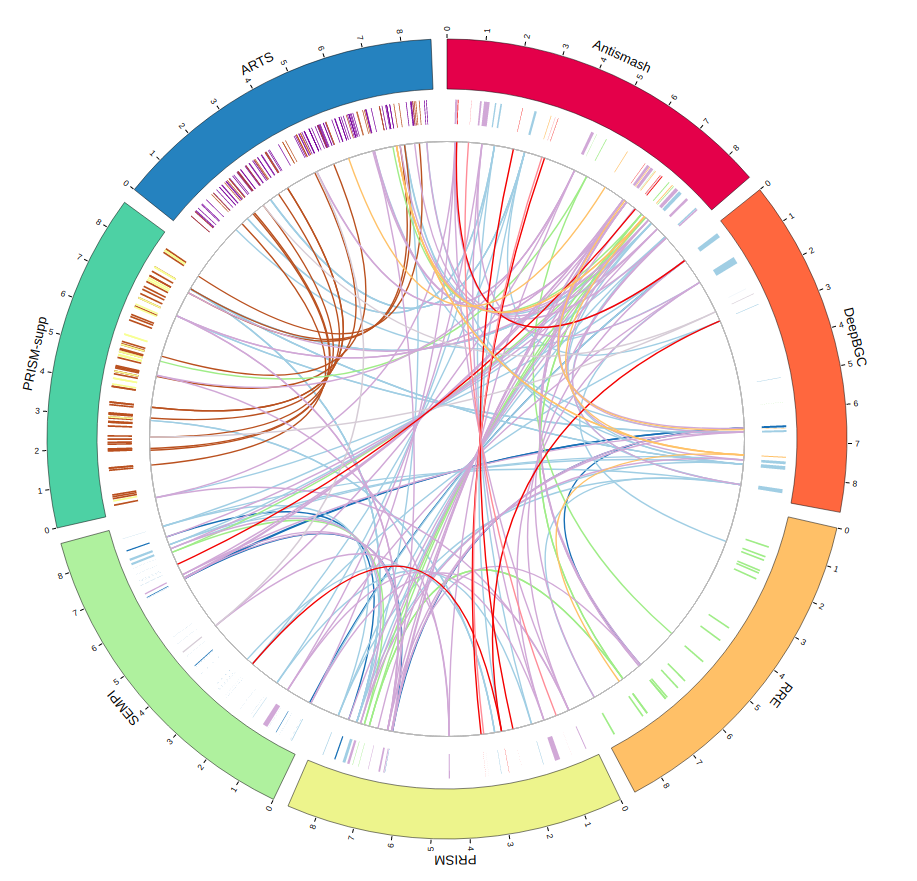

# BGCViz <!-- omit in toc --> 

BGCViz is a[shiny application (can be run locally, or via [website](https://biopavlohrab.shinyapps.io/BGCViz/)), which uses genomic coordinates of BGC annotations from PRISM, Antismash, DeepBGC and RREFinder to visualize interception between them in one sequence (genome). This integrative approach could point to both:
 - "regions of interest", annotated with more that one tool.
 - novel regions, annotated only by one of the methods.

This app is written as a part of **Cambridge Bioinformatics Hackaton 2020** ([link](https://cambiohack.uk)). 

## Table of Contents <!-- omit in toc --> 
- [Introduction](#introduction)
- [Prerequisites](#prerequisites)
- [Installation](#installation)
- [Usage](#usage)
  - [Input files](#input-files)
  - [Controls](#controls)
  - [Result plots](#result-plots)
- [Citation](#citation)

## Introduction
BGCViz is an app for a simple visual comparison of BGC annotations in one genome. For basic functionality is depends on two files - antismash.csv and  deepbgc.tsv files **(** see [input files](#input-files) for more information about input formats **)** <br>
This basic functionality allows to:
- explore deepbgc and antismash bgc annotations with different deepbgc filters
- filter deepbgc data on various score simultaniously in an simple GUI (with sliders). 

For extended functionality, as BioCircos plot and bgc on chromosome plots , RREFinder and PRISM data should be also uploaded **(** see [input files](#input-files)  **)**. <br>
Extended functionality consist of:
- "BGC on chromosomes" plot, which uses antismash as a reference annotation, and plot only intercepted antismash bgc with other app. On hover additional info is available
- BioCircos plot, which actually demostrated links between clusters, annotated with different tools. (all-vs-all comparison)
- Barplot which on y axis holds an info how many times cluster was annotated and on x axis - cluster ID. So that, clusters which were annotated by ,ultiple tools can be named as "regions of interest"

## Prerequisites
App is written entirielly in R. <br>
 **Note:**  the [web version](https://biopavlohrab.shinyapps.io/BGCViz/) is also available, with no installation needed. <br>
Needed for a local run:
- R ( v. 4.0.2 )  [site](https://www.r-project.org)
- Rstudio ( v. 1.3.959 )  [site](https://rstudio.com)
- shiny ( v. 1.5.0 )
- tidyverse ( v. 1.3.0 )
- plyr ( v. 1.8.6 )
- IntervalSurgeon ( v. 1.0 )
- plotly ( v. 4.9.2.1 )
- BioCircos ( v. 0.3.4 )
- ggplot2 ( v. 3.3.2 )


## Installation
All packages can be installed via R console in Rstudio via:
```R
install.packages(c("BioCircos", "ggplot2", "plotly", "IntervalSurgeon", "plyr", "tidyverse", "shiny" ))
``` 
If conda package manager is installed (see [Anaconda](https://www.anaconda.com) or [Miniconda](https://docs.conda.io/en/latest/miniconda.html)) you can use the followingcommand to install R and Rstudio:

`conda install r-base rstudio`

## Usage
Local run:
1. Open app.R in Rstudio
2. Press "Run app" button on upper right corner of script window.

App should open in a viewer panel in Rstudio, or in a default web browser. The plots willl be visible as soon as input files are uploded. 
### Input files
- Antismash and PRISM are comma-separated files, with 4 columns -> "Cluster", "Start", "Stop", "Type", where "Cluster" column holds clusted IDs as numbers. <br> Example: (for data see example_data folder) <br>
 <br>
- deepbgc.tsv file is an standart tsv file output from DeepBGC. <br>
Example: (data in in example_data folder) <br>
 <br>
- RREFinder.txt file is standart txt output file from RREFinder tool. But as a delimiter double underscore is used "__". So for proper parsing of this file, expected sequence name is: "Sequence-name__Coordinates__Gene-ID",  possible "__Coordinates__product-description__Gene-ID" is reformated with product-decription deleted. <br>
Example: (data example is in example_data folder) <br>
 <br>
### Controls
The app consist of three input categories:
1. Files upload and chromosome length input (mandatory inputs) <br>
 <br>
2. DeepBGC and antismash data comparison plots controls. Those used for the first two result plots <br>
 <br>
3. DeepBGC filtering controls. Applied globally + download datasets button is available <br>
 <br>
### Result plots
1. Barplot with comparison of DeepBGC and antismash data. Have three categories -> "Annotated only by antismash", "Annotated by antismash and deepbgc", "Annotated only by deepbgc"

2. Connected scatterplot with Novelty, Annotation and Skip rates, where:
   - Novelty rate = "# of BGC annotated only by deepbgc"/("# clusters annotated with only by antismash" + "# clusters annotated with antismash and deepbgc"). This rate points to how much clusters are annotated only by DeepBGC.
   - Annotation rate = "# of BGC annotated by antismash and deepbgc"/"total number of antismash annotated BGC". This rate points to how much DeepBGC annotated clusters alongside with antismash. 
   - Skip rate = "# of BGC annotated only by antismash"/"total number of antismash clusters". This rate points of how much clusters DeepBGC missed, assuming, that antismash is a reference annotation <br>

 <br>
3. "BGC on chromosome" plots. On hover additional data is available 
   - First row is antismash BGC data plotted
   - Rows under have the following structure: Reference_data_with_only_intercepted_results, data_with_which_the_interception_was_performed. The example can be "A_vs_D" and "D" rows. So "A_vs_D" holds antismash clusters (we use this annotation as a reference), which intercepts with the DeepBGC data (the row below). "D" row is all DeepBGC data plotted (not only intercepted. 


4. BioCircos plot. Here all-vs-all comparison is performed. Hover on links gives a little bit of additional info, as IDs of cluster of connected annotation tools, names of those tools and types of clusters.
<br>


5. Barplot, which shows how many times given cluster is annotated by other tools.

## Citation
This project is still a work in progress, so there is no official publication. If it was useful you can cite it as: <br>
P. Hrab & B. Ostash 2020: BGCViz, GitHub repository: https://github.com/pavlohrab/BGCViz
